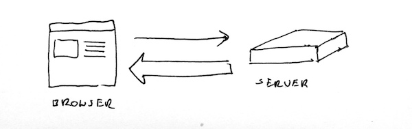
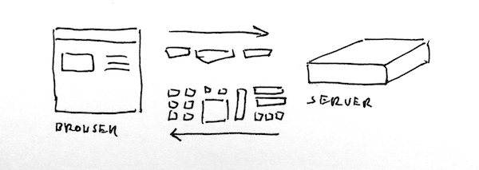
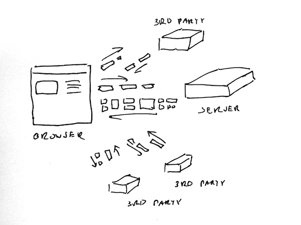
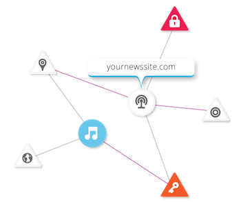
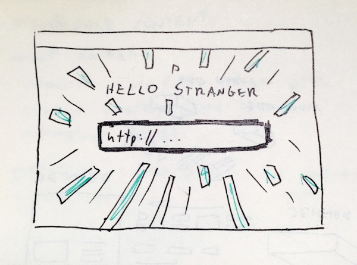
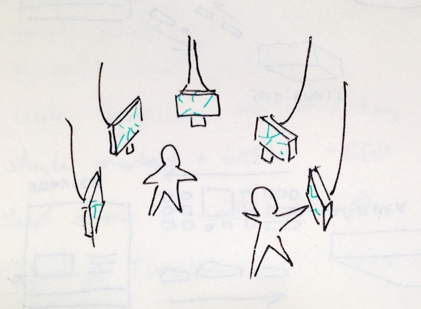
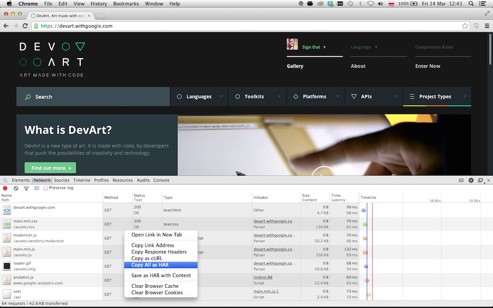

## What I'm trying to do?

I'm trying to visualise what seems to be a single web page request in an engaging way.

**Here is what appears to be happening**: We click a link and the server responds with a website.

**Here is what we hope to be happening**: We click a link and our browser sends a request packages (together with IP, cookies, user agent information etc) and the server responds with data packages (text, photos, video files etc)

**Here is what is really happening**: We click a link and our browser sends a request packages (together with IP, cookies, user agent information etc) and the server responds with data packages (text, photos, video files etc). But nowadays the websites are built from many separate blocks so we actually talk to many servers at once. Photos might come from photo hosting website, friend list from your social network, ads from an ad provider. Each one of them will know a little more about us every time and that's something that is not transparent.

*How many kilobytes have you left behind in the last week? Last month? Last year?*

## Why I'm doing it?

I want to remove layers of abstractions obscuring nowadays technologies. I want to transform conversation about data and privacy into feelings and emotions.

There are existing projects like [Mozilla Lightbeam](https://www.mozilla.org/en-US/lightbeam/ "Mozilla Lightbeam") (previously called Collusion) or [disconnect.me](https://disconnect.me "Disconnect Me") that tried to address the same issue. They both use a browser extension to track pages visited by the user and keep list of 3rd party websites that we exchanged some data with. The problem with their approach is that it's a passive experience expressed in data-speak.

*Image from [Mozilla Lightbeam](http://www.mozilla.org/en-US/lightbeam/) website:*

While this might be appealing to a data-geek, I would like to have something faster, dynamic, more immersive that will poke you in your head and change the way you think about web forever.

## How I'm going to do it?

**Online experience**

I want to keep the project website as simple as possible. Enter the website address you would like to visit, press enter and boom : you are emerged in stream of data. It should be fast (offer autocomplete suggestions as you type) and handle user errors (suggest websites with similar names). If you don't know where to go there should be some suggestions like most popular hits etc. 

Additionally I want to customise the experience based on your location, language and time of the day.

**Exhibition experience**

Initial concept is to present live stream of pages visited by online users. Of course there should be a way for exhibition visitors to interact as well, either via their smartphone or touch. 

For the technology part I'm hoping to use raspberry pi with screens or fall back to tablets if necessary.

### Stretch goals

As a longer term goal I would love to move beyond gallery space and develop two more experiences:

**Mobile experience**

iOS and Android app - more than simply mobile version of the main website. The whole UI would have to be rethought and additionally it might be needed to develop native version of the app because of performance reasons. 

**Always on experience**

Basically a browser extension that on a click of a button "explode this page" would transform current website without need to go to the project page. Any time, on any page.

## Technology

### Frontend

Both the website and exhibition installation will be powered by WebGL running in newest Google Chrome but also should work in Firefox and Safari.

### Backend

At the core of the system lies HTTP Archive (HAR) file format. It's a log file containing information about all bits and pieces that happened between your browser and other servers when loading the page.

You can have a look at it yourself:

1. Opening any page in Google Chrome. 
2. Right click somewhere on the page and choose "Inspect Element" 
3. Switch to "Network"" tab
4. Reload the website and see the data flowing in
5. Right click anywhere on the request timeline and choose "Save as HAR with Content" or "Copy All as HAR". In the second case you will have to go to your favourite text editor, paste the text from your clipboard and save file manually.

### Automation

I can't ask every visitor to do the steps above every time they visit a page. I don't want them to install anything as well. Therefore I will create a server making requests to the pages on behalf of the user using [Google App Engine](https://developers.google.com/appengine/) and server side WebKit Client [Ghost.py](http://jeanphix.me/Ghost.py/). All you need to do is enter the url and I will playback already stored data or generate new one if you wish to see a website never requested before.

### Privacy

I'm going to discuss potential privacy issues and walled garden websites more in the upcoming posts.

## Additional goals

Restart my conversation with folks at Mozilla and disconnect.me (and Google if there are interested people there) about possible collaboration how this project might help them in what they are trying to communicate already. I see big potential in sharing data and experiences between these projects.

Improve documentation for [plask](http://plask.org) and [pex](http://github.com/vorg/pex) in order to get out of "black-box engine" approach.

