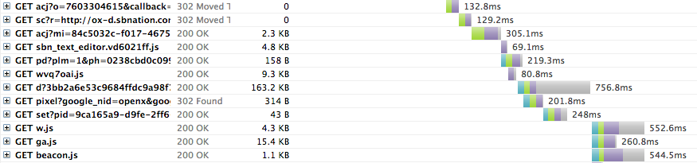

## Burst

Burst is the name of first visual approach I tried this week. It's a visualization of data from [theverge.com](http://theverge.com) on 11th of March 2014. To load this one page:

* **105** different request were made
* **12** different types of file were downloaded (js, html, gif, ...)
* **22** different webservers were contacted (twitter, fb, google, chartbeat, ...)

It's a hommage to stereotypical virutal reality look. Beam of light, a tunnel, DATA streams.This is actually happening everytime you visit that website. What's interesting here is the time stretch approach. What took only couple of seconds (depending on you internet connection speed) is exploded and stretched both in time and space. I like looking at the data throught a microscope and discovering a another micro world there.

Right now it doesn't really make sense, colors are assigned per file type but not grouped by server and not sorted by time. You need to start somewhere...

You can see the it live here:
[http://marcinignac.com/projects/you-are-the-data/lab/01_burst/](http://marcinignac.com/projects/you-are-the-data/lab/01_burst/)

## Data

Here is the same data [theverge20140311.har](https://github.com/vorg/devart-template/blob/master/project_code/lab/01_burst/data/temp/theverge20140311.har) (just a part of it) visualized using online [HAR Viewer](http://www.softwareishard.com/har/viewer/).

## Animation

To make the animation I saved separate frames from Plask and put them together using [omggif](https://github.com/deanm/omggif "omggif") using code little sketch I called [gifgen](https://github.com/vorg/devart-template/tree/master/project_code/lab/02_gifgen).

## Glitch

A the begginig I had outdated version of the library that produced cool looking glitches if there was too many colors used:

*Click to see animated gif as DevArt img encoder has some problems with this one.*

